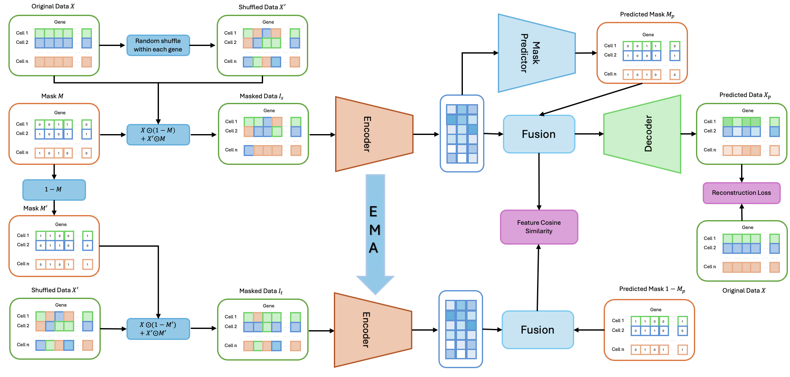

# sc-DMAE

## Installation
The code is based on Python3.11. You could use either virtualenv or conda to setup a specified environment. And then run:
```bash
pip install -r requirements.txt
```

## Model Architecture


## Run experiments
### Training:
Modify the configuration file to set up the path:
```bash
data_path: /path/to/all/datasets
results_path: /path/to/save/metrics
save_path: /path/to/save/checkpoints/logs/embeddings
```

Then run:
```bash
python main.py --config config.yaml
```
